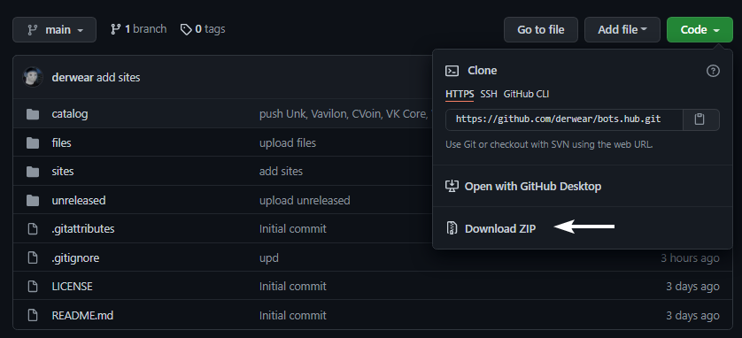
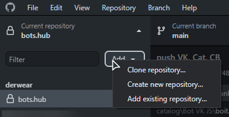
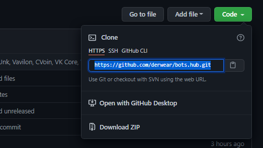
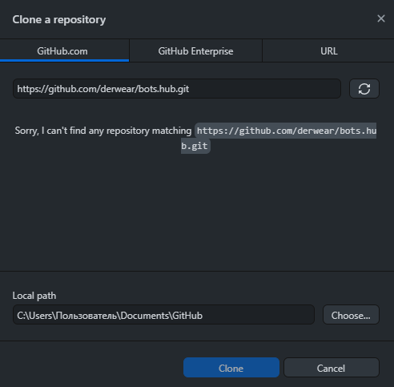

## About the repository
welcome to the bots hub. this repository is a public hub where bots, sites and scripts are collected, in short, everything related to VK and bots.

## Clone Repository
>**I don't have a github desktop...**
>Click on the **Сode** and click **"Download ZIP"**

>**I have a github desktop...**
>- Open Github Desktop
>- Сlick "Add", and click "Clone Repository"

>- Copy link (in browser, after click "Code")

>- Paste link to the field, select path, and click "Clone"

...or...

>- Click "Code"
>- Select "Open with Github Desktop"

## How do I offer my script?
If you want to give away your unnecessary script (any), [create an issue](https://github.com/derwear/bots.hub/issues/new), write a short description of your script, and attach it *(in the appropriate field at the bottom of the text field).*

**Important!!**
- the script should not contain the node_modules folder
- the script may be non-working 
- your issue may be rejected without explanation
